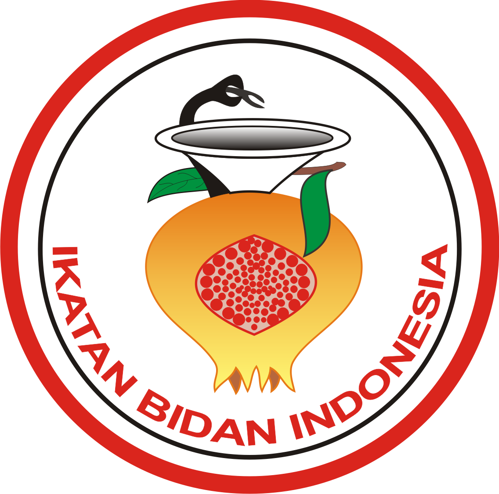

## Tentang Bidan Nurhalimah

Bidan Nurhalimah merupakan salah satu bidan praktek mandiri yang berada di daerah kabupaten karawang, kecamatan klari di desa cimahi.

Bidan prakter Nurhalimah sudah berdiri kurang lebih 2 tahun, yang bertujuan untuk melayani masyarakat terutama ibu dan bayi dalam kehamilan, persalinan, dan program keluarga berencana (KB).

Seiring perkembangannya waktu, Bidan Nurhalimah telah memiliki banyak Pasien. Dari banyakannya pasien tersebut, proses pencatatan data riwayat pasien hingga pengelolaan data yang ada pada Bidan Nurhalimah sudah semakin banyak dan menumpuk, maka dari ini diperlukan sebuah teknologi yang cepat dalam melakukan pencarian data, fleksibel di semua perangkat dan telah ada pada Era saat ini.

Repository ini merupakan tempat penyimpanan aplikasi berbasis website yang telah kami buat, aplikasi ini di namakan dengan Website Bidan Nurhalimah.
Aplikasi berbasis website tersebut digunakan untuk melakukan pencatatan riwayat kunjungan pasien ke Bidan Nurhalimah, hingga pengelolaan data pada Bidan Nurhalimah.

Pada aplikasi ini terdapat 3 actor yaitu diantaranya :
- Admin
- Staf
- Pasien

Dari ketiga aktor diatas memiliki peranananya masing masing

### Fitur
1. Login 
2. Registrasi
3. Lupa Password
4. Verifikasi Email
5. Notifikasi Email
6. Manajemen Pengguna
7. Manajemen Jabatan (Role) - Admin
8. Manajemen Posisi Staf - Admin
9. Manajemen Data Pekerjaan (Jobs) - Admin
10. Manajemen Data Pendidikan/Lulusan - Admin
11. Manajemen Obat - Admin | Bidan
12. Pendaftaran Pasien - Admin | Bidan
13. Pencatatan Pengobatan, Hingga Pencarian Riwayat Pasien

Aplikasi Bidan Nurhalimah ini dibangun menggunakan bahasa pemrograman PHP, HTML, CSS dan Java Script. 
Dalam pengembangan aplikasi ini, di sisi Front End dibuat menggunakan bantuan dari framewok CSS yaitu Bootstrap dan Jquery dan untuk di sisi Backend dibuat menggunakan framework artisan yaitu laravel. 

## Tentang Laravel

Laravel adalah framework aplikasi web dengan sintaks yang ekspresif dan elegan. Kami percaya pengembangan harus menjadi pengalaman yang menyenangkan dan kreatif agar benar-benar memuaskan. Laravel dapat diakses, kuat, dan menyediakan alat yang diperlukan untuk aplikasi yang besar dan tangguh.

## Kerentanan Keamanan

Jika Anda menemukan kerentanan keamanan dalam Laravel, silakan kirim email ke Taylor Otwell melalui [taylor@laravel.com](mailto:taylor@laravel.com). 
Semua kerentanan keamanan akan segera ditangani.

## Lisensi

Kerangka kerja Laravel adalah perangkat lunak sumber terbuka yang dilisensikan di bawah [MIT license](https://opensource.org/licenses/MIT).
